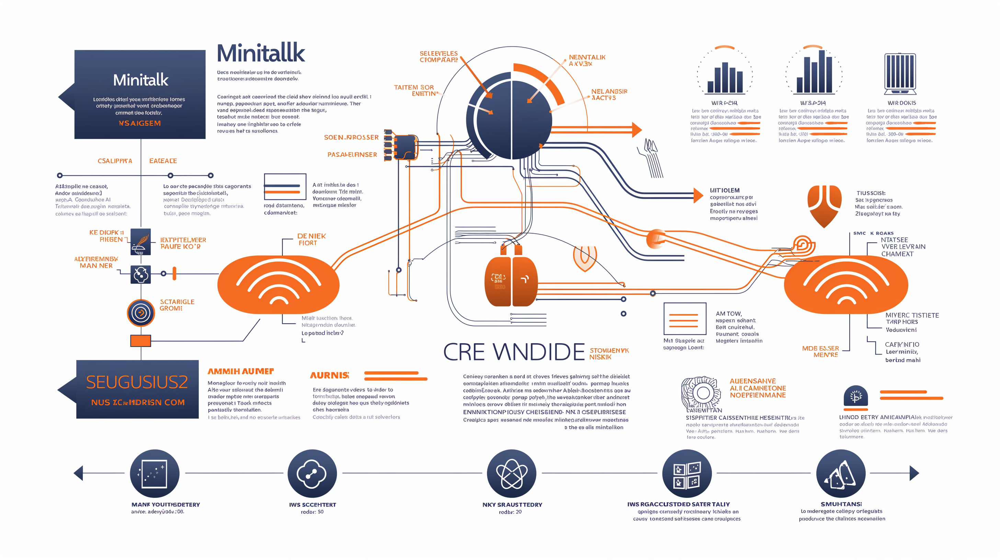

# Minitalk

Le projet Minitalk de l'École 42 consiste à développer un programme de communication entre processus en utilisant les signaux UNIX. L'objectif est de créer un serveur capable de recevoir et d'afficher des messages envoyés par un client, en se servant exclusivement des signaux SIGUSR1 et SIGUSR2 pour transmettre les données. 
42-CURSUS.GITBOOK.IO

🎯 Objectifs du Projet

Communication Inter-Processus (IPC) : Mettre en place une communication efficace entre deux processus distincts en utilisant les signaux UNIX.

Gestion des Signaux : Apprendre à manipuler et à gérer les signaux SIGUSR1 et SIGUSR2 pour transmettre des informations entre le client et le serveur.

Conversion des Données : Convertir les messages en une forme binaire afin de les transmettre bit par bit via les signaux, puis les reconstruire correctement du côté du serveur.

🛠️ Spécifications Techniques

Programmes à Développer :

Serveur :

Doit afficher son PID (Process ID) au lancement.
Attend de recevoir des messages du client et les affiche dès réception.
Client :

Prend en paramètres le PID du serveur et le message à envoyer.
Envoie le message au serveur en utilisant uniquement les signaux SIGUSR1 et SIGUSR2.
Contraintes :

Utilisation exclusive des signaux SIGUSR1 et SIGUSR2 pour la communication.
Gestion des erreurs, notamment la validation des PID et la vérification de la bonne réception des messages.
Respect des normes de codage de l'École 42.

🔧 Approche d'Implémentation
Initialisation du Serveur :

Le serveur démarre et affiche son PID, permettant au client de le cibler pour la communication.
Mise en place d'un gestionnaire de signaux pour traiter SIGUSR1 et SIGUSR2.
Envoi du Message par le Client :

Le client convertit chaque caractère du message en sa représentation binaire.
Pour chaque bit, le client envoie SIGUSR1 pour un bit à 0 et SIGUSR2 pour un bit à 1 au PID du serveur.
Réception et Reconstruction du Message par le Serveur :

Le serveur reçoit les signaux et reconstruit les caractères en assemblant les bits reçus.
Une fois le message complet, il l'affiche à l'écran.
Gestion des Cas Particuliers :

Assurer la synchronisation entre le client et le serveur pour éviter les pertes de données.
Gérer les interruptions et les erreurs potentielles lors de la transmission.

📂 Structure du Projet
Fichiers Principaux :

server.c : Contient le code du serveur, y compris l'initialisation, la gestion des signaux et l'affichage des messages reçus.
client.c : Contient le code du client, responsable de la conversion du message en signaux et de leur envoi au serveur.
Makefile : Automatise la compilation des programmes client et serveur.
Fonctions Autorisées :

malloc, free, write, getpid, signal, sigemptyset, sigaddset, sigaction, pause, kill, sleep, usleep, exit.

🧪 Tests et Validation
Tests Fonctionnels :

Vérifier que le client peut envoyer des messages de différentes longueurs au serveur.
Confirmer que le serveur affiche correctement les messages reçus.
Tests de Robustesse :

Tester la gestion des erreurs, comme l'envoi d'un message à un PID invalide.
Évaluer le comportement du système lors de l'envoi simultané de messages par plusieurs clients.
Tests de Performance :

Mesurer le temps de transmission pour des messages de grande taille.
Analyser l'utilisation des ressources système pendant la communication.

📚 Ressources Utiles

Articles et Tutoriels :
[Guide du Projet Minitalk][https://42-cursus.gitbook.io/guide/rank-02/minitalk]

Dépôts GitHub :
[Exemple d'Implémentation de Minitalk][https://github.com/julienhouyet/42-minitalk]
